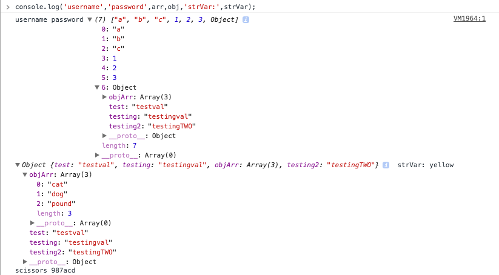
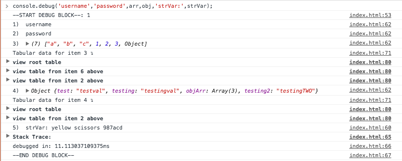
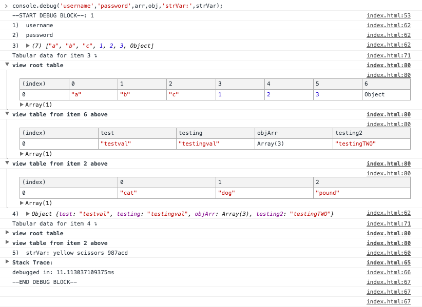

# A Verbose Console Extension for Front-End JavaScript Debugging

This allows you to more easily see the variables, strings, and objects that you wish to print out in the Developer's Tool console.
It returns a "pretty print" version of what you would console log.

With the built in _console.log_ method you would see something along the lines of:


and when you expand it:  


With the _qonsole.debug_ method you will see something along the lines of:


and when you expand it:  


## Usage:
Import the script into your page.  
That will allow you access to the _qonsole.debug_ method.

By default each item that you log will be logged on its own line.  
There will be recursively nested tables that display for each array and object within the item.

You can also grab a version of the package for purely front-end use from github. Install it as you would any other external javascript file using the _<script src=""></script>_ tags. That version is available here: []()

### Options
In addition to displaying the format using _console.log_ you can also specify to use _info_, _warn_, or _error_.  
You do this by passing the display option as the first argument:
```javascript
  qonsole.debug(console.WARN,'username','password',arr,obj,'strVar:',strVar);
```
The options are:
* qonsole.LOG (default)
* qonsole.INFO
* qonsole.ERR
* qonsole.WARN

You are also able to globally set the log level for all output using _qonsole.debug_.  
You do this by calling using the _setLogLevel_ method.
```javascript
  console.setLogLevel(qonsole.DEBUG);
```
The options are:
* qonsole.DEBUG (default)
* qonsole.NORM (displays the generic _console.log_ method)
* qonsole.PROD (suppresses all logging)

If you want to override the log level for a single console statement, you can do so by chaining the _isLevel_ method to the beginning of the _debug_ method.
```javascript
  qonsole.setLogLevel(qonsole.PROD);
  qonsole.debug(qonsole.WARN,'username','password',arr,obj,'strVar:',strVar); //will not display due to logLevel being set to "PROD" above
  qonsole.isLevel(qonsole.DEBUG).debug(qonsole.ERROR,'username','password',arr,obj,'strVar:',strVar); //will display using "pretty print" style
```

Qonsole also supports toggling the logs on a group level. For instance if you had separate components, and each component was labeled as a different group you could allow qonsole to only show the logs from a single component.
```javascript
//to set the group that the log belongs to just chain the group beforehand:
qonsole.setGroup('group1').debug(qonsole.WARN,'GROUP1 DEBUG GROUP','password',arr,obj,'strVar:');
//setGroup allows you to choose whether to display the message using qonsole.DEBUG(default) or qonsole.NORM
qonsole.setGroup('group1',qonsole.NORM).debug(qonsole.WARN,'GROUP1 NORM GROUP');
qonsole.setGroup('group2').debug('GROUP2 GROUP',);
qonsole.setGroup('group3').debug('GROUP1  GROUP');
```
Using the above, you would enable the group filtering by setting `showGroups` before any `qonsole.debug` calls were made. `showGroups` expects an array of the groups to display.
```javascript
qonsole.showGroups(['group1','group3']);
```

Lastly, although it is not fully supported by all browsers, you can enable profiling.  
_**WARNING:**_ This will _greatly_ increase load time and memory usage.
```javascript
  qonsole.DO_PROFILE = true;
```

##### _Additional Notes:_
* There are 2 blank lines after each debug block. This is intentional to help differentiate the individual method calls.
* Due to the _qonsole.debug_ method handling all logging, the line numbers will not match up to where the _qonsole.debug_ method was called in the original javascript code. To handle this, at the end of the _DEBUG BLOCK_, there is a collapsed _Stack Trace:_ object. If you expand that you can see where the _qonsole.debug_ call originated from.
* If _showGroups_ is used, the default mode is automatically set to _qonsole.PROD_, allowing only the groups specified in the array to display.
